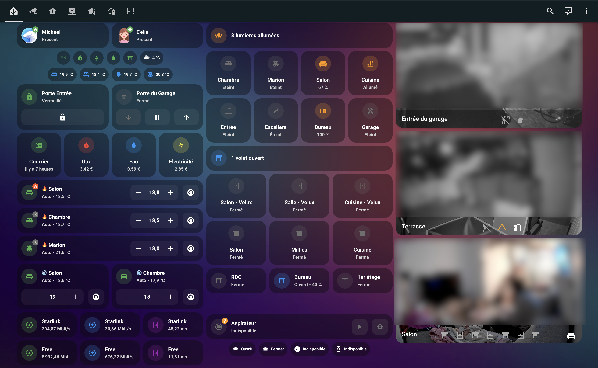
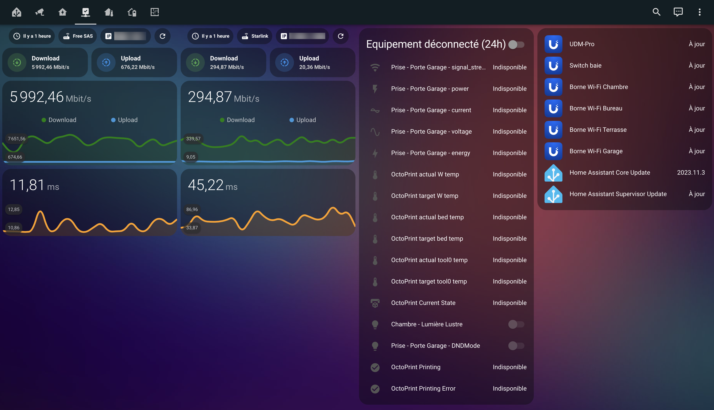

  

  

    Update : 2023/02/27 
    Article Tech2Tech (in French) : Bientôt en ligne 😉

    
    
    
     

# Here are some pictures of my different dashboards

## Main Dashboard

## Energy Dashboard

## Network Dashboard

## Cameras Dashboard

